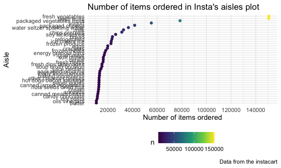

p8105\_hw3\_TZ2472
================
tianwei zhao
10/12/2021

``` r
library(tidyverse)
```

    ## ── Attaching packages ─────────────────────────────────────── tidyverse 1.3.1 ──

    ## ✓ ggplot2 3.3.5     ✓ purrr   0.3.4
    ## ✓ tibble  3.1.4     ✓ dplyr   1.0.7
    ## ✓ tidyr   1.1.3     ✓ stringr 1.4.0
    ## ✓ readr   2.0.1     ✓ forcats 0.5.1

    ## ── Conflicts ────────────────────────────────────────── tidyverse_conflicts() ──
    ## x dplyr::filter() masks stats::filter()
    ## x dplyr::lag()    masks stats::lag()

``` r
theme_set(theme_minimal() + theme(legend.position = "bottom"))

options(
  ggplot2.continuous.colour = "viridis",
  ggplot2.continuous.fill = "viridis"
)

scale_colour_discrete = scale_colour_viridis_d
scale_fill_discrete = scale_fill_viridis_d
```

## Problem 1

The goal is to do some exploration of this dataset. To that end, write a
short description of the dataset, noting the size and structure of the
data, describing some key variables, and giving illstrative examples of
observations. Then, do or answer the following (commenting on the
results of each):

``` r
library(p8105.datasets)
data("instacart")


#an illustrative example of the first order:
instacart %>% 
  filter(order_id%in%  "1")
```

    ## # A tibble: 8 × 15
    ##   order_id product_id add_to_cart_order reordered user_id eval_set order_number
    ##      <int>      <int>             <int>     <int>   <int> <chr>           <int>
    ## 1        1      49302                 1         1  112108 train               4
    ## 2        1      11109                 2         1  112108 train               4
    ## 3        1      10246                 3         0  112108 train               4
    ## 4        1      49683                 4         0  112108 train               4
    ## 5        1      43633                 5         1  112108 train               4
    ## 6        1      13176                 6         0  112108 train               4
    ## 7        1      47209                 7         0  112108 train               4
    ## 8        1      22035                 8         1  112108 train               4
    ## # … with 8 more variables: order_dow <int>, order_hour_of_day <int>,
    ## #   days_since_prior_order <int>, product_name <chr>, aisle_id <int>,
    ## #   department_id <int>, aisle <chr>, department <chr>

In the instacart data set, we have a total of 1384617 observations, each
represents an order in instacart .The data has 15 variables, collects
key information about instacart such as : order identifier, product
identifier, order in which each product was added to cart, reordered
records, customer identifier, the order sequence number for usesr, the
day of the week on which the order was placed, the hour of the day on
which the order was placed, days since the last order, name of the
product, aisle identifier,department identifier, name of the aisle, name
of the department.

Take example of the first order of instacart,On Thursday 10 o’clock, an
user ID 112108 check out 8 items that are Bulgarian Yogurt, Organic 4%
Milk Fat Whole Milk Cottage Cheese, Organic Celery Hearts, Cucumber
Kirby, Lightly Smoked Sardines in Olive Oil, Bag of Organic Bananas,
Organic Hass Avocado, Organic Whole String Cheese(exactly in this
order).Those items are in aisle of yogurt,other creams cheeses,fresh
vegetables,fresh vegetables,canned meat seafood,fresh fruits, fresh
fruits,and packaged cheese.It has been 9 days since the user 112108’s
last order.Among the orders, Bulgarian Yogurt, Organic 4% Milk Fat Whole
Milk Cottage Cheese,Lightly Smoked Sardines in Olive Oil,Organic Whole
String Cheese are ordered before, and the rest are new tries to this
user.

How many aisles are there, and which aisles are the most items ordered
from?

``` r
instacart %>% 
  count(aisle,aisle_id) %>% 
  arrange(desc(n))
```

    ## # A tibble: 134 × 3
    ##    aisle                         aisle_id      n
    ##    <chr>                            <int>  <int>
    ##  1 fresh vegetables                    83 150609
    ##  2 fresh fruits                        24 150473
    ##  3 packaged vegetables fruits         123  78493
    ##  4 yogurt                             120  55240
    ##  5 packaged cheese                     21  41699
    ##  6 water seltzer sparkling water      115  36617
    ##  7 milk                                84  32644
    ##  8 chips pretzels                     107  31269
    ##  9 soy lactosefree                     91  26240
    ## 10 bread                              112  23635
    ## # … with 124 more rows

The result data set(134\*3) gives us the most ordered items in the first
row,from the table we can find there are 134 aisles and the fresh
vegetables is the most items ordered from.

Make a plot that shows the number of items ordered in each aisle,
limiting this to aisles with more than 10000 items ordered. Arrange
aisles sensibly, and organize your plot so others can read it.

``` r
  instacart %>% 
  count(aisle) %>% 
  arrange(n) %>% 
  filter(n>10000) %>% 
  mutate(
    aisle = factor(aisle),
    aisle = forcats::fct_reorder(aisle, sort(n))) %>% 
  ggplot(aes(x=n,y=aisle,color = n))+
  geom_point()+
  labs(
    title = "Number of items ordered in Insta's aisles plot",
    x = "Number of items ordered",
    y = "Aisle",
    caption = "Data from the instacart"
  )+
  scale_x_continuous(
    breaks = c(0,20000,40000,60000,80000,100000,120000,140000)
  )
```

<!-- -->

I arrange the aisles in a increasing order of number of items ordered
for better readability, and use color function to denote the difference
of number of items ordered.The lighter the color is , the more the item
ordered.

Make a table showing the three most popular items in each of the aisles
“baking ingredients”, “dog food care”, and “packaged vegetables fruits”.
Include the number of times each item is ordered in your table.

``` r
new_df = instacart %>% 
  filter(aisle%in%c("baking ingredients", "dog food care","packaged vegetables fruits")) %>% 
  group_by(product_name,aisle) %>% 
  summarize(n_obs=n())
```

    ## `summarise()` has grouped output by 'product_name'. You can override using the `.groups` argument.

``` r
baking_df = 
  filter(new_df,aisle%in% "baking ingredients") %>% 
  arrange(desc(n_obs)) %>% 
  filter(n_obs> 330)

dog_df = 
  filter(new_df,aisle%in% "dog food care") %>% 
  arrange(desc(n_obs)) %>% 
  filter(n_obs> 25)

vegfruit_df = 
  filter(new_df,aisle%in% "packaged vegetables fruits") %>% 
  arrange(desc(n_obs)) %>% 
  filter(n_obs> 4060)

top3_table = 
  bind_rows(baking_df,dog_df,vegfruit_df) %>% 
  relocate(aisle) %>% 
  rename(num_of_time_ordered = n_obs) %>% 
  knitr::kable(caption = "TOP3 Popular Items")

top3_table
```

| aisle                      | product\_name                                 | num\_of\_time\_ordered |
|:---------------------------|:----------------------------------------------|-----------------------:|
| baking ingredients         | Light Brown Sugar                             |                    499 |
| baking ingredients         | Pure Baking Soda                              |                    387 |
| baking ingredients         | Cane Sugar                                    |                    336 |
| dog food care              | Snack Sticks Chicken & Rice Recipe Dog Treats |                     30 |
| dog food care              | Organix Chicken & Brown Rice Recipe           |                     28 |
| dog food care              | Small Dog Biscuits                            |                     26 |
| packaged vegetables fruits | Organic Baby Spinach                          |                   9784 |
| packaged vegetables fruits | Organic Raspberries                           |                   5546 |
| packaged vegetables fruits | Organic Blueberries                           |                   4966 |

TOP3 Popular Items

In the table top3\_table, it contains the top 3 popular items’ names and
number of times ordered in baking ingredients aisle, dog food care
aisle, and packaged vegetables fruits aisle.

Make a table showing the mean hour of the day at which Pink Lady Apples
and Coffee Ice Cream are ordered on each day of the week; format this
table for human readers (i.e. produce a 2 x 7 table).

``` r
pinkapple_df = instacart %>% 
  filter(product_name%in%c("Pink Lady Apples","Coffee Ice Cream"))%>% 
  group_by(order_dow,product_name) %>% 
  summarize(
    mean_hour = mean(order_hour_of_day)) %>% 
  pivot_wider(
    names_from = "order_dow",
    values_from = "mean_hour",
  ) %>% 
  rename("Sunday" = "0", 
         "Monday" = "1", 
         "Tuesday" = "2", 
         "Wednesday" = "3",
         "Thursday" = "4",
         "Friday" = "5",
         "Saturday" = "6") %>% 
  knitr::kable(caption = "Mean Hour on Each Day of the Week")
```

    ## `summarise()` has grouped output by 'order_dow'. You can override using the `.groups` argument.

``` r
pinkapple_df
```

| product\_name    |   Sunday |   Monday |  Tuesday | Wednesday | Thursday |   Friday | Saturday |
|:-----------------|---------:|---------:|---------:|----------:|---------:|---------:|---------:|
| Coffee Ice Cream | 13.77419 | 14.31579 | 15.38095 |  15.31818 | 15.21739 | 12.26316 | 13.83333 |
| Pink Lady Apples | 13.44118 | 11.36000 | 11.70213 |  14.25000 | 11.55172 | 12.78431 | 11.93750 |

Mean Hour on Each Day of the Week

This table shows the mean hour of the day at which Pink Lady Apples and
Coffee Ice Cream are ordered on each day of the week. The mean hour of
the day that people order Pink Lady Apples and Coffee Ice Cream is
around 11 o’clock and 14 o’clock. The mean varies very slightly in each
day of the week.

\#\#Problem 2
